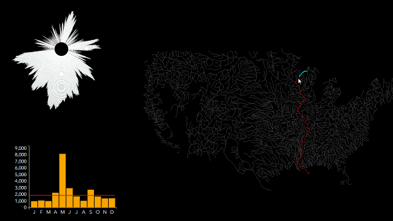

# Esri-Hydro-Hierarchy

Hydro Hierarchy is an experimental web application for visualizing the US river network.

Click [here](http://richiecarmichael.github.io/radial/index.html) to view the live application.

There are approximately a quarter of a million rivers in the United States, but only 2,500 are displayed in this application.  This subset represents streams with a [Strahler stream order](http://en.wikipedia.org/wiki/Strahler_number) classification of four or greater.  The stream data used by this application is derived from the [USGS](http://www.usgs.gov/)‘s [National Hydrographic Dataset](http://nhd.usgs.gov/) and has undergone significant spatial editing.  Streams geometries have been adjusted to ensure connectivity, generalized for small scale mapping and re-oriented in the direction of flow.

River flow data was acquired from the USGS’s [WaterWatch](http://waterwatch.usgs.gov/new/) website.  Each river segment is attributed with the average flow for each month in 2014 and the ten year monthly average.  Computed values, in cubic feet per second, represent the flow at the downstream end of each river.  Flow data is displayed as a column chart on the left hand side of the browser window whenever the user’s mouse passes over a stream.

The preview animated image at the beginning of this post may look sped up.  It is not.  Upstream and downstream rivers are highlighted in real time as the user moves his or her cursor over the hydrologic network.  This performance is achieved using connectivity information loaded when the application first starts from [this](https://github.com/richiecarmichael/Esri-Hydro-Hierarchy/blob/master/river.js) file.  The file was creating in ArcMap from a network dataset that included the river feature class.  Using the [arcmap.txt](https://github.com/richiecarmichael/Esri-Hydro-Hierarchy/blob/master/arcmap.txt) script, connectivity information for each network node was extracted and arranged into a hierarchical data structure.

The radial and column charts on the left hand side of the application are generated using the D3 graphics library.  The column chart displays 2014 flow data for any river segment that is directly below the user’s mouse.  The horizontal red line represents the ten year mean monthly flow.  Note that for most river segments, only one or two months ever exceeded the ten year average.  This is indicative of 2014′s drought, at least with respect to river flows over the past decade.

